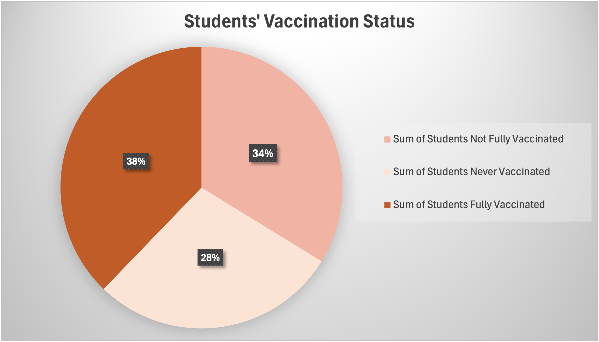
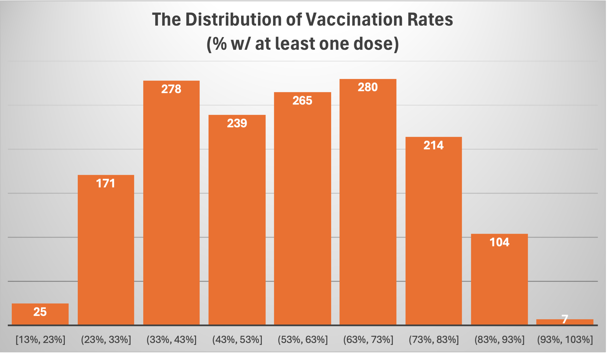
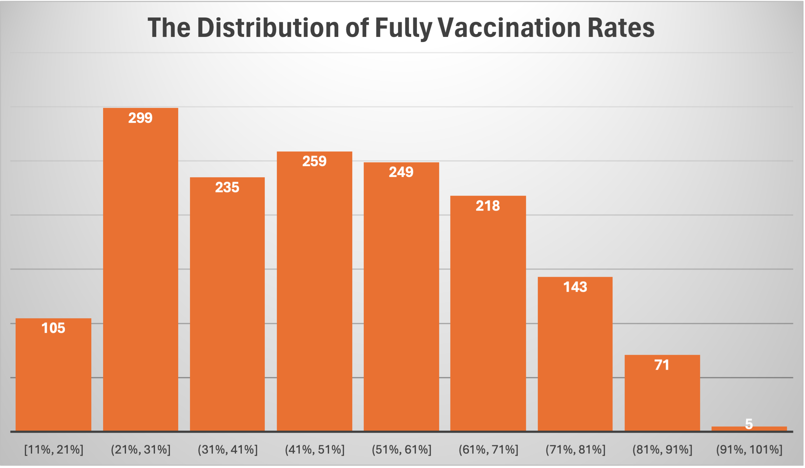

# Spreadsheet Analysis
## Data set details

### The origin of the data set 
I found the dataset "Student COVID Vaccinations (3-24-2022)" from NYC Open Data website, which is provided By New York City Department of Education. 
[Link to the dataset: Student COVID Vaccinations (3-24-2022)](https://data.cityofnewyork.us/Education/Student-COVID-Vaccinations-3-24-2022-/q5xz-reje/data_preview)
This dataset contains information about vaccination in schools, including columns for the school DBN (District Borough Number), the number of students over five active on register, the number of students with at least one dose, the percentage with at least one dose, the number of students fully vaccinated, and the percentage fully vaccinated. The original data file was in CSV.

### The first 20 rows of the the raw data
| School DBN | # of students over five active on register | # of students w/ at least one dose | % w/ at least one dose | # of students fully vaccinated | % fully vaccinated |
|------------|--------------------------------------------|------------------------------------|------------------------|--------------------------------|--------------------|
| 01M015     | 169                                        | 62                                 | 0.367                  | 53                             | 0.314              |
| 01M019     | 168                                        | 79                                 | 0.47                   | 65                             | 0.387              |
| 01M020     | 307                                        | 159                                | 0.518                  | 123                            | 0.401              |
| 01M034     | 244                                        | 99                                 | 0.406                  | 71                             | 0.291              |
| 01M063     | 161                                        | 76                                 | 0.472                  | 58                             | 0.36               |
| 01M064     | 185                                        | 77                                 | 0.416                  | 66                             | 0.357              |
| 01M110     | 296                                        | 164                                | 0.554                  | 153                            | 0.517              |
| 01M134     | 165                                        | 58                                 | 0.352                  | 41                             | 0.248              |
| 01M140     | 325                                        | 158                                | 0.486                  | 126                            | 0.388              |
| 01M142     | 283                                        | 101                                | 0.357                  | 75                             | 0.265              |
| 01M184     | 674                                        | 579                                | 0.859                  | 545                            | 0.809              |
| 01M188     | 377                                        | 141                                | 0.374                  | 104                            | 0.276              |
| 01M292     | 284                                        | 203                                | 0.715                  | 180                            | 0.634              |
| 01M315     | 282                                        | 220                                | 0.78                   | 206                            | 0.73               |
| 01M332     | 191                                        | 136                                | 0.712                  | 114                            | 0.597              |
| 01M361     | 252                                        | 168                                | 0.667                  | 142                            | 0.563              |
| 01M363     | 221                                        | 178                                | 0.805                  | 156                            | 0.706              |
| 01M364     | 219                                        | 125                                | 0.571                  | 111                            | 0.507              |
| 01M378     | 170                                        | 107                                | 0.629                  | 90                             | 0.529              |


## Data scrubbing
Fortunately, this dataset is already in usable format. There is no missing value or unnecessary columns. Thus, I just use Python to adjust some data and add some computed columns to make the data analysis easier.

Firstly, the raw data only provide data of the number & percentage of students with at least one dose / fully vaccinated. In order to better understand the dataset and find useful insights, I add 4 new columns which provide the number & percentage of students not fully vaccinated & students never vaccinated. 
```
    header = rows[0]
    header.extend([
        '# of students not fully vaccinated', 
        '% of students not fully vaccinated', 
        '# of students never vaccinated', 
        '% of students never vaccinated'
    ])
    writer.writerow(header)
```
Here is the calculation process of new values:
```
        not_fully = student - stu_fully
        never_vaccinated = student - stu_onedose
        percent_not_fully = (not_fully / student) * 100 if student > 0 else 0
        percent_never = (never_vaccinated / student) * 100 if student > 0 else 0
```
Next, I format percentages to three decimal places，making original and newly calculated data display in a uniform way.
```
percent_not_fully_formatted = f"{percent_not_fully:.3f}"
        percent_never_formatted = f"{percent_never:.3f}"
```

Links to data files:
- [The original raw data](data/raw_data.csv)
* [The munged data](data/clean_data.csv) 
+ [The spreadsheet file](data/clean_data.xlsx)

## Analysis
### Average and Sum of students
I use `AVERAGE()` to calculate the Average of Total Students/School. This represents the mean number of students registered across all schools in the dataset, giving an idea of the typical school size.

I use `SUM()` to calculate the Sum of Students Not Fully Vaccinated, Sum of Students Never Vaccinated, and Sum of Students Fully Vaccinated. These data can be summarized and compared to give a general picture of student vaccinations.

I use `AVERAGEIF()`to calculate the Average Total Students in Schools with More Than 50% Fully Vaccinated / 50% Never Vaccinated. This data helps to analyze whether vaccination rates are correlated with school size. We can find that the average number of students in schools where more than 50% have never been vaccinated is 532.8, which is close to the overall average, suggesting that the issue of students remaining unvaccinated is widespread and not confined to schools of a specific size.

I use `SUMIF()` to calculate the Sum of Total Students for Schools with More Than 30% Never Vaccinated / Fully vaccinated. If we take 30% as a standard, a vaccination rate greater than 70% is considered excellent and less than 30% is considered in need of more attention，this two data can clearly shows the reach of successful vaccination programs.

### Maximum and Minimum Percentage of Students Fully Vaccinated
I use `MAX()` and `MIN()`to calculate the Maximum and Minimum Percentage of Students Fully Vaccinated. The schools with the most successful and most impeded vaccination rate are evident, representing the highest and lowest level for New York City schools.

I use `MAXIFS()` and `MINIFS()` to calculate Maximum / Minimum Number of Never Vaccinated Students in Schools with More Than 300 Total Students. This data shows that vaccination rates in large schools.

### Data Visualization

Vaccination Status Comparison: Here is a pie chart which compares the overall number of students fully vaccinated, not fully vaccinated, and never vaccinated, and we can also find the percentage of each component in the total number of students. We can find that the percentage of sum of students fully vaccinated has the largest share (38%), the percentage of sum of students never vaccinated has the smallest share (28%). But the percentages for the three components are very close. It shows the insight that NYC schools have a good rate of fully student vaccinations, but there are still many students never vaccinated who need attention.

This histogram shows the distribution of vaccination rates (% w/ at least one dose) across NYC schools. This visualization helps identify the general trend of students with at least one dose, indicating the vaccination rate in most schools is between 30% and 70%.

This histogram shows the distribution of vaccination rates (% fully vaccinated) across NYC schools. It shows how many schools fall into various ranges of vaccination coverage. This visualization helps identify the general trend in vaccination rates, indicating fully vaccination rate in most schools is between 20% and 70%.

### Some Insights
+ The percentages being close for fully vaccinated, not fully vaccinated, and never vaccinated students suggest a somewhat evenly distributed vaccination status. This indicates that while progress has been made in vaccination efforts, there is still considerable work to be done to achieve higher levels of immunity within the school populations.
+ The size of the school does not significantly influence the vaccination rates, suggesting that factors other than size are more critical in determining the success of vaccination campaigns.
+ The highest vaccination rate observed is 93.2%，and the lowest vaccination rate is only 10.5% of students fully vaccinated. The wide range of vaccination rates points to potential disparities in public health outreach, access to vaccines, or community attitudes towards vaccination.